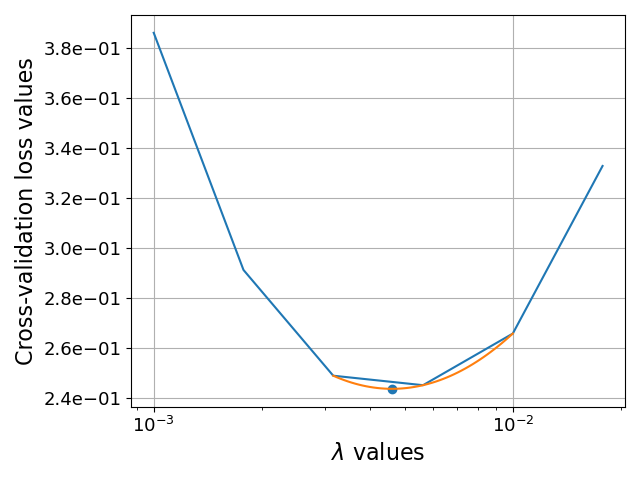
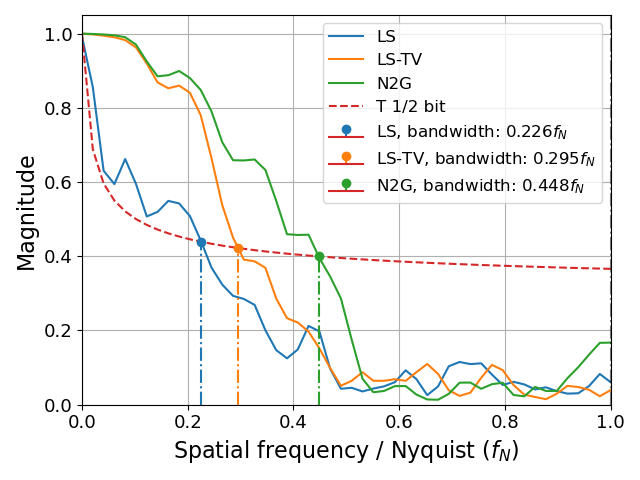
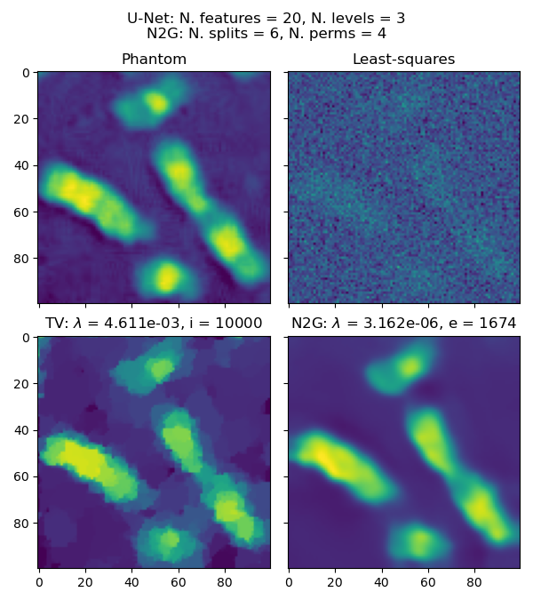

# Synthetic Data - Compression Ratio 10x - Gaussian Noise

In this tutorial, we'll explore the process of reconstructing a phantom image using different methods and comparing the results.

## Introduction

We demonstrates the use of different reconstruction methods on a phantom image of chromosomes. We'll use least-squares (LS), total variation (TV), and a neural network-based method called Noise2Ghost (N2G) to reconstruct the image [1].  We will impose a 10x compression ratio (10 times fewer measurements than reconstructed pixels), and add Gaussian noise to the measurements.

[1] M. Manni, D. Karpov, K. Joost Batenburg, S. Shwartz, and N. Vigano, "Noise2Ghost: self-supervised deep convolutional reconstruction for ghost imaging," Opt. Express, vol. 34, no. 13, p. 24787, Jun. 2026, doi: 10.1364/OE.596142.

## Setup

First, let's import the necessary libraries and modules:

```python
import matplotlib.pyplot as plt
import numpy as np
from autoden.models.config import NetworkParamsUNet
from corrct.param_tuning import get_lambda_range
from corrct.regularizers import Regularizer_TV2D
from corrct.processing.post import plot_frcs

from noise2ghost.reconstructions import RecParsCNN, fit_neural_cnn_reg_weight, fit_variational_reg_weight
from noise2ghost.testing import create_datasets
```

## Creating the Dataset

We'll create a dataset using the `create_datasets` function. This function generates a phantom image of chromosomes and applies a sampling ratio of 10, photon density of 1e8, and readout noise standard deviation of 5.0.

```python
info, volumes, data, _ = create_datasets(
    phantom_type="chromosomes",
    sampling_ratio=10,
    photon_density=1e8,
    reg_val_tv=None,
    readout_noise_std=5.0,
)
```
!!! note Available phantoms
    We select the phantom type `"chromosomes"`. Other options include: `"dots"`, three flat dots (useful as an initial simple test case), `"toy_xray"`, an X-ray image of a plastic toy, and `"shepp-logan"`, which is the well-known Shepp-Logan phantom from the field of tomography. We set the compression ratio to 10x, by setting the value of the variable `sampling_ratio`.

## Least-Squares Reconstruction

A LS reconstruction is provided by the synthetic data creation function. The LS minimizes the sum of the squared differences between the observed and predicted values.

```python
gi_ls = np.squeeze(volumes["reconstruction_ls"])
```

## Total Variation Reconstruction

Next, the TV regularized LS reconstruction is a method used to solve inverse problems where the solution is constrained by both the data fidelity term and a regularization term (i.e., the TV). In our case, the TV term promotes piece-wise constant regions in the reconstruction.

The forward model is defined by the equation: $y = Wx$, where: $y$ is the acquired data (measured buckets), $W$ is the operator (stack of masks), and $x$ is the sought solution.

The objective function for the TV regularized LS reconstruction is given by:
$$
\hat{x} = \min_x \{ \frac{1}{2} || Wx - y ||_2^2 + \lambda || \nabla x ||_1 \}
$$
where $\frac{1}{2} | Wx - y |_2^2$ is the data fidelity term, which ensures that the solution $x$ is consistent with the acquired data $y$, $| \nabla x |_1$ is the TV regularization term, which promotes piecewise constant solutions and helps to remove noise and artifacts, and $\lambda$ is the regularization weight that controls the trade-off between the data fidelity term and the regularization term.

The value of $\lambda$ is unknown and it depends on each specific acquisition. The strategy we use for selecting it is through the computation of a cross-validation loss over a hold-out set. More precisely, we set aside 10% of the acquired measurements, which are not used for reconstruction. We then sample a range of $\lambda$ values, and compute one corresponding reconstruction each of those different values. We then compute the cross-validation loss over the hold-out set, and select the lambda value that minimizes it.

```python
reg_vals_tv = get_lambda_range(1e-4, 1e-2)
best_reg_val_tv, volumes["reconstruction_tv"], _ = fit_variational_reg_weight(
    data["masks"], data["buckets"][0], reg=Regularizer_TV2D, lambda_range=reg_vals_tv, normalize=True
)
gi_tv = volumes["reconstruction_tv"]
```

!!! note Regularization weight range
    In the code above, the first line defines the range of the $\lambda$ parameters to test.

Once the reconstruction is done, we can observe the cross-validation loss for all the tested $\lambda$ parameters:  


## Noise2Ghost Reconstruction

Finally, we use the N2G algorithm to reconstruct the same data. We use a U-Net with 3 levels and 20 features, and organize our data into 6 splits and 4 different permutations. For the selection of the regularization value, we use the same strategy as for the TV reconstruction. For further details, we refer to the published article on N2G [1].

```python
net_pars = NetworkParamsUNet(n_features=20, n_levels=3)
rec_pars_n2g = RecParsCNN(net_pars, num_splits=6, num_perms=4, epochs=1024 * 6)
reg_vals_n2g = get_lambda_range(5e-7, 5e-5)
best_reg_val_n2g, gi_n2g, losses, _ = fit_neural_cnn_reg_weight(
    data["masks"], data["buckets"][0], rec_pars=rec_pars_n2g, reg_vals=reg_vals_n2g
)
```

## Results

Let's first have a look at some performance metrics for the different reconstructions:
```python
from skimage.metrics import mean_squared_error as mse
from skimage.metrics import peak_signal_noise_ratio as psnr
from skimage.metrics import structural_similarity as ssim

phantom = volumes["phantom"]
data_range = phantom.max() - phantom.min()

vols = [gi_ls, gi_tv, gi_n2g]
labs = ["LS", "LS-TV", "N2G"]

print("PSNR, range: [0, +inf), unit: [dB]")
for lab, vol in zip(labs, vols):
    print(f"- {lab:<8}: {psnr(phantom, vol, data_range=data_range):.4}")
print("SSIM, range: [0, 1]")
for lab, vol in zip(labs, vols):
    print(f"- {lab:<8}: {ssim(phantom, vol, data_range=data_range):.4}")
print("MSE, range: [0, +inf)")
for lab, vol in zip(labs, vols):
    print(f"- {lab:<8}: {mse(phantom, vol):.4}")

plot_frcs([(phantom, vol) for vol in vols], labs, snrt=0.4142)
```

Producing:
```
PSNR, range: [0, +inf), unit: [dB]
- LS      : 12.79
- LS-TV   : 22.47
- N2G     : 25.79
SSIM, range: [0, 1]
- LS      : 0.1237
- LS-TV   : 0.7038
- N2G     : 0.8036
MSE, range: [0, +inf)
- LS      : 0.03736
- LS-TV   : 0.004025
- N2G     : 0.001872
```  


And then let's visualize the results of the different reconstruction methods:

=== "Image"
    

=== "Code"
    ```python
    fig, ax = plt.subplots(2, 2, sharex=True, sharey=True, figsize=[6, 6.75])
    fig.suptitle(
        f"U-Net: N. features = {net_pars.n_features}, N. levels = {net_pars.n_levels}\n"
        f"N2G: N. splits = {rec_pars_n2g.num_splits}, N. perms = {rec_pars_n2g.num_perms}"
    )
    vminmax = dict(vmin=phantom.min(), vmax=phantom.max())
    ax[0, 0].imshow(phantom)
    ax[0, 0].set_title("Phantom")
    ax[0, 1].imshow(gi_ls, **vminmax)
    ax[0, 1].set_title("Least-squares")
    ax[1, 0].imshow(gi_tv, **vminmax)
    ax[1, 0].set_title(f"TV: $\lambda$ = {best_reg_val_tv:.3e}, i = {rec_info_tv.best_residual_ind_val}")
    ax[1, 1].imshow(gi_n2g, **vminmax)
    ax[1, 1].set_title(f"N2G: $\lambda$ = {best_reg_val_n2g:.3e}, e = {np.argmin(losses['loss_tst'])}")
    fig.tight_layout()
    ```  
